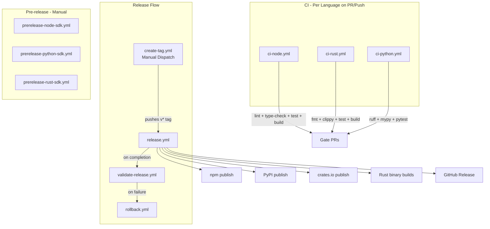

# CI/CD Workflows

This directory contains GitHub Actions workflows for continuous integration, testing, and releases.

## Architecture



## Workflows

### Continuous Integration

These workflows run automatically on pull requests and pushes to main:

- **[`ci-node.yml`](workflows/ci-node.yml)** - Node.js SDK CI
  - Linting, type checking, testing, and building
  - Runs on Node.js 20

- **[`ci-rust.yml`](workflows/ci-rust.yml)** - Rust SDK CI
  - Formatting (`cargo fmt`), linting (`cargo clippy`), testing, and building

- **[`ci-python.yml`](workflows/ci-python.yml)** - Python SDK CI
  - Linting (`ruff`), type checking (`mypy`), and testing (`pytest`)
  - Runs on Python 3.10, 3.11, and 3.12

### Pre-release Workflows

Manual workflows for publishing pre-release versions (alpha, beta, rc):

- **[`prerelease-node-sdk.yml`](workflows/prerelease-node-sdk.yml)** - Publish Node.js SDK pre-release to npm
- **[`prerelease-python-sdk.yml`](workflows/prerelease-python-sdk.yml)** - Publish Python SDK pre-release to PyPI
- **[`prerelease-rust-sdk.yml`](workflows/prerelease-rust-sdk.yml)** - Publish Rust SDK pre-release to crates.io

**How to trigger:** Go to Actions → Select workflow → Run workflow → Provide inputs:
- Pre-release label (e.g., `alpha`, `beta`, `rc`)
- Branch containing changes

### Release Workflows

- **[`create-tag.yml`](workflows/create-tag.yml)** - Create and push a version tag
  - **Trigger:** Manual dispatch
  - **Inputs:** Version bump type (patch/minor/major/custom)
  - Creates a `v*` tag which triggers the release workflow

- **[`release.yml`](workflows/release.yml)** - Full release process
  - **Trigger:** Automatically on push of `v*` tags
  - Runs tests for all languages
  - Publishes to npm, PyPI, and crates.io
  - Builds Rust binaries for multiple platforms
  - Creates GitHub Release
  - Sends Slack notifications

- **[`validate-release.yml`](workflows/validate-release.yml)** - Validate release artifacts
  - **Trigger:** Automatically after release completes
  - Verifies published packages (npm, PyPI, crates.io) and binaries

- **[`rollback.yml`](workflows/rollback.yml)** - Rollback to a previous version
  - **Trigger:** Manual dispatch
  - **Inputs:** Target version and reason
  - Deletes problematic release and creates rollback tag

## Pre-commit Hooks

Pre-commit hooks automatically fix linting and formatting issues before commits, preventing fixable failures in CI.

### Setup

1. **Install pre-commit:**
   ```bash
   pip install pre-commit
   ```

2. **Install the git hooks:**
   ```bash
   pre-commit install
   ```

3. **Run on all files (optional, for initial setup):**
   ```bash
   pre-commit run --all-files
   ```

### Configured Hooks

- **Python**: Runs `ruff check --fix` and `mypy` on Python files
- **Node.js**: Runs `biome check --write` on TypeScript/JavaScript files
- **Rust**: Runs `cargo fmt --all` on Rust files
- **General**: Checks for trailing whitespace, end-of-file fixes, YAML validation, and large files

Hooks run automatically on `git commit` and only process staged files. To bypass (not recommended), use `git commit --no-verify`.

## Release Process

1. **Create Tag:** Run `create-tag.yml` workflow manually
   - Choose version bump type (patch/minor/major) or provide custom version
   - Workflow creates and pushes the tag

2. **Release:** `release.yml` automatically triggers on tag push
   - Tests all SDKs
   - Publishes packages
   - Builds binaries
   - Creates GitHub Release

3. **Validation:** `validate-release.yml` runs automatically
   - Verifies all artifacts were published correctly

4. **Rollback (if needed):** Run `rollback.yml` manually
   - Specify target version and reason
   - Deletes problematic release and tags
